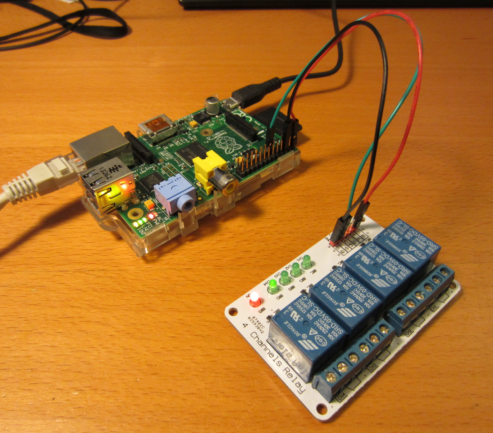

# qpiGPIO aka the Qt sysfs gpio wrapper

A linux sysfs gpio wrapper impl in QT for systems like the Raspberry PI.


## sysfs gpio

A test with pin11 (gpio 17)
```
echo 17 > /sys/class/gpio/export
echo "out" > /sys/class/gpio/gpio17/direction 
echo "1" > /sys/class/gpio/gpio17/value 
echo "0" > /sys/class/gpio/gpio17/value 

# Or the same but with high/low and not in/out
echo "high" > /sys/class/gpio/gpio17/direction
echo "low"  > /sys/class/gpio/gpio17/direction
```

## Links

* http://www.raspberrypi.org/documentation/usage/gpio/
* https://www.kernel.org/doc/Documentation/gpio/sysfs.txt
* http://elinux.org/RPi_Low-level_peripherals
* http://elinux.org/RPi_Low-level_peripherals#C_.2B_sysfs

### Links to parts

* http://lawicel-shop.se/prod/Relay-Module---4-Ch-5-VDC_999096/ElecFreaks_91902/SWE/SEK
* http://www.raspberrypi.org/

## Raspberry Pi, relayboard

A Raspberry PI connected with a ElecFreaks relayboard on pin11

